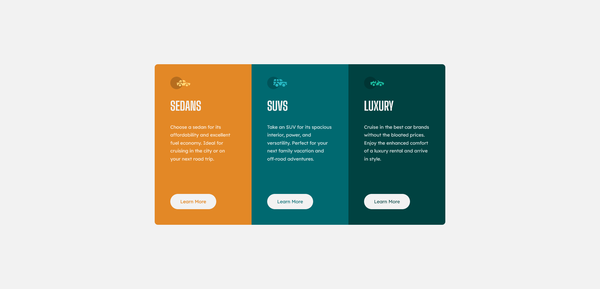

# Frontend Mentor - 3-column preview card component solution

This is a solution to the [3-column preview card component challenge on Frontend Mentor](https://www.frontendmentor.io/challenges/3column-preview-card-component-pH92eAR2-). Frontend Mentor challenges help you improve your coding skills by building realistic projects.

## Table of contents

- [Overview](#overview)
  - [The challenge](#the-challenge)
  - [Screenshot](#screenshot)
  - [Links](#links)
- [My process](#my-process)
  - [Built with](#built-with)
  - [What I learned](#what-i-learned)
  - [Continued development](#continued-development)

## Overview

The challenge is to build a responsive 3-column preview card component and get it looking as close to the design as possible by using any tools I'd like to help me complete the challenge.

### The challenge

Users should be able to:

- View the optimal layout depending on their device's screen size
- See hover states for interactive elements

### Screenshot

### Links

- Solution URL: [https://github.com/ricochet69/3-COLUMN-PREVIEW-CARD-COMPONENT](https://github.com/ricochet69/3-COLUMN-PREVIEW-CARD-COMPONENT)
- Live Site URL: [https://ricochet69.github.io/3-COLUMN-PREVIEW-CARD-COMPONENT](https://ricochet69.github.io/3-COLUMN-PREVIEW-CARD-COMPONENT)

## My process

Initally I thought CSS Grid would be a good choice to complete this challenge however, I wanted to practice using Flexbox more to build on my understanding of when and where to use it. I adopted a mobile first approach and created a main container to house my cards meaning I could centre it on screen by applying Flex to the body element. From there I built the styling for a single card, then targeting specific cards using "nth-child" selectors for anything more specific. All buttons have hover and focus states.

### Built with

- Semantic HTML5 markup
- CSS custom properties
- Flexbox
- Mobile-first workflow

### What I learned

My understanding of Flexbox became a lot more defined by completing this challenge.

### Continued development

I will continue my use of Flexbox to fully graps the concept and use cases of the tool.
